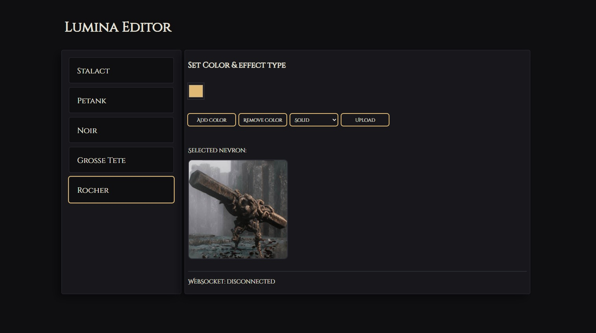
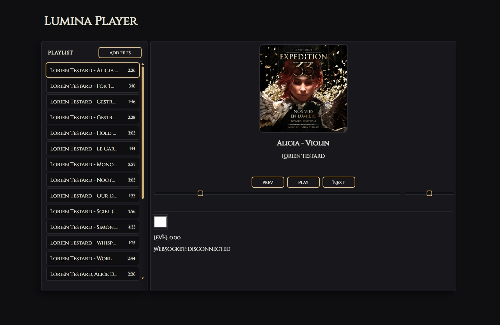

# Nevron-Sensing Lumina Converter Lamp

Lumina Converter lamp from Clair Obscur: Expedition 33. Uses ESP32 + PN532 to detect RFID Nevrons and trigger LED effects.

Creates an access point "Lumina Converter" that hosts a webpage at lumina.local.

[3D files can be downloaded here](https://www.printables.com/model/1381562-nevron-sensing-lumina-converter-expedition-33)

## Lumina Editor

Pick your Nevron and edit its colors & effects.

## Lumina Player

Simple JS player app that controls the lamp brightness in real-time according to the audio file currently playing.

## Setup

It's a bit tricky to set up, here are some helpful links:

- [Arduino IDE 2 Install ESP32 LittleFS](https://randomnerdtutorials.com/arduino-ide-2-install-esp32-littlefs/)
- [How to use the PN532 RFID NFC Reader with Arduino](https://38-3d.co.uk/blogs/blog/how-to-use-the-pn532-rfid-nfc-reader-with-arduino?srsltid=AfmBOoohU9yYqFPuTKpl0WOnk3jVLxrAlvHZ307p4cRyKMBRa8yP8YWq)
- [ESP32 Access Point (AP) Web Server](https://randomnerdtutorials.com/esp32-access-point-ap-web-server/)
- [Adafruit PN532 Library](https://github.com/adafruit/Adafruit-PN532/tree/master)
- [Adafruit NeoPixel Library](https://github.com/adafruit/Adafruit_NeoPixel)
- [Arduino WebSockets Library](https://github.com/Links2004/arduinoWebSockets)
- [ESP32 mDNS Tutorial](https://lastminuteengineers.com/esp32-mdns-tutorial/)
- [ESP32 Preferences Library Tutorial](https://iotcircuithub.com/esp32-preferences-library-tutorial/)
- [Color Picker CodePen](https://codepen.io/miguelznunez/pen/OJmGrzG)
- [NoSleep.js Library](https://github.com/richtr/NoSleep.js/)